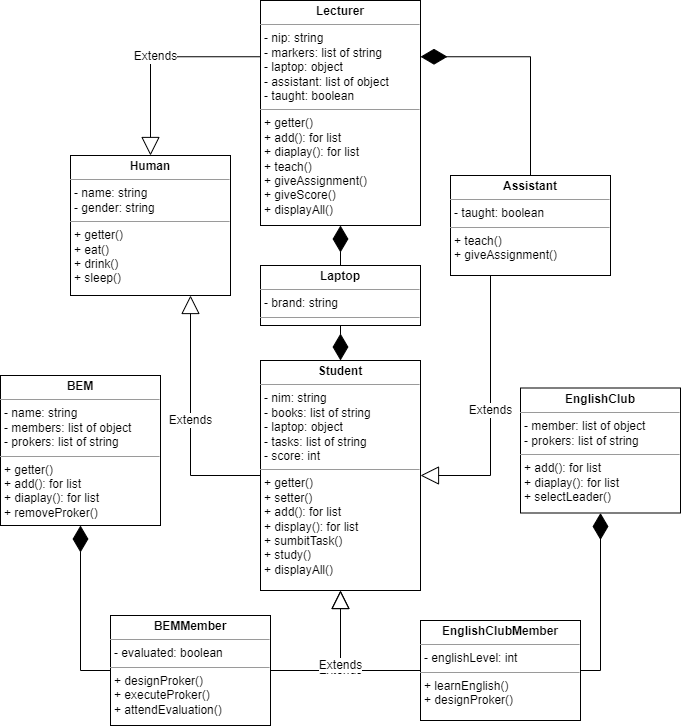
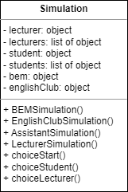
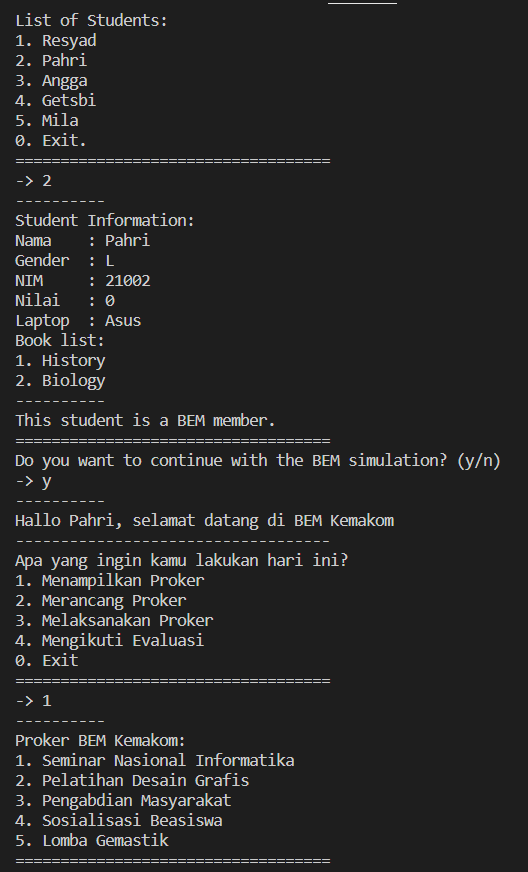

# **TP1DPBOC22023**
Berdasarkan Soal cerita [TP1](https://docs.google.com/document/d/1hyeyXVUPqrUfeBQE7ueA633qNJDrhlFA/edit), ambil kata kunci yang sekiranya penting, kemudian buatlah desain, objek, serta relasinya menggunakan OOP!
---
- -
Saya Muhammad Fadhillah Nursyawal NIM 2107135 mengerjakan soal TP 1
dalam mata kuliah Desain Pemrograman Berorientasi Objek 
untuk keberkahanNya maka saya tidak melakukan kecurangan seperti yang telah dispesifikasikan. Aamiin.


## **Desain Program**
Program dibuat dalam bahasa pemrograman `python`.

### **Class Diagram UML**



***Catatan UML:*** 
- *`getter()` pada desain `UML` tersebut merupakan getter dari setiap `atribut` pada setiap `kelas`,*
- *untuk method `add()` dan `display()` merupakan method untuk setiap atribut yang bertipe data list,* 
- *selain itu `construktor` dan `destruktor` tidak saya cantumkan dalam desain UML karena sudah pasti ada.*
- *selengkapnya ada di file [Note-TP1.txt](Note-TP1.txt)*

### **Penjelasan Inheritance dan Composite**
dibawah ini penjelasan tentang inheritance dan composite pada desain yang saya buat:
- **Student `is a` human:**  
Sudah pasti mahasiswa merupakan manusia, manusia juga mempunyai atribut dan method yang dibutuhkan Mahasiswa. alasan lain karena ada kelas dosen agar menghemat penggunaan kode. jadi Student `inheritance` Human.
- **Lecturer `is a` human:**  
Sudah pasti dosen merupakan manusia, jadi dosen `inheritance` Human.
- **BEMMember `is a` Student:**  
BEMMember disini merupakan mahasiswa, namun mahasiswa belum tentu anggota BEM. anggota BEM memiliki special method nya sendiri sehingga BEMMember merupakan turunannya dari Mahasiswa. jadi BEMMember `inheritance` Student.
- **EnglishClubMember `is a` Student:**  
sama seperti sebelumnya, EnglishClubMember juga mempunya special methodnya sendiri, belum tentu mahasiswa punya method tersebut, namun anggota english club masih merupakan mahasiswa. jadi EnglishClubMember `inheritance` Student.
- **Assistant `is a` Student:**  
Asisten juga merupakan mahasiswa, namun mahasiswa belum tentu menjadi asisten. jadi Assistant `inheritance` Student.

***Tambahan:*** *Dalam desain terdapat `Multi-level Inheritance` dari `Human` parent yang paling atas lalu ke `Student` childnya dan kebawah lagi yaitu `BEMMember`, `EnglishClubMember` dan `Assistant` yang menjadi Child paling akhir.*

- **Student `has a` laptop:**
- **Lecturer `has a` laptop:**  
mahasiswa dan dosen mempunyai laptop. saya buat laptop menjadi kelas agar dapat terhubung dengan kedua kelas tersebut, namun jujur saja kurang efisien.

- **BEM `has a` BEMMember:**  
BEM mempunyai anggota BEM sudah pasti. sebetulnya mereka saling terhubung karena saya buat simulasi anggota BEM dapat merancang Proker dan menyimpannya di list proker kelas BEM. dan anggota BEM ini disimpan juga dalam list anggota BEM dalam kelas BEM
- **EnglishClub `has a` EnglishClubMember:**  
untuk yang ini juga sama seperti BEM punya anggota BEM. saling terhubung juga, namun dengan method yang berbeda. anggota English Club dapat melakukan method yang dapat mempengaruhi EnglishClub class untuk melakukan method juga.
- **Lecturer `has a` Assistant:**  
ini hanya untuk hubungan saja sebagai dosen mempunyai asisten dosennya yang membantu tugasnya.

## **Penjelasan Alur**
Alur dimulai dari memasukan data yang ada di dalam soal kedalam kodenya langsung (`hardcode`), dengan data data yang saya tambahkan juga seperti laptop, buku, ataupun proker.  

Alur program dijalankan menggunakan kelas `Simulasi` yang nantinya akan mensimulasikan proses masing-masing kelas. simulasi dibuat untuk memenuhi nilai `bonus` pada soal.  



***Catatan:***  *kelas ini seharisnya `composite` pada setiap kelas yang ada di desain program kecuali kelas Human dan Laptop. namun karena tidak ingin merusak keestetikan diagram desain jadi saya pisahkan.*

Awal simulasi kita akan diberi menu pilihan
```
Choice:
1. Mahasiswa
2. Dosen
0. Exit
```
kita dapat memilih dengan menginput number `int` nanti sistem akan mengalihkan pada pilihan kita. 

di setiap pilihan kecuali exit, sistem akan menampilkan menu lagi untuk memilih mahasiswa atau dosen yang mana yang akan kita pilih. contoh jika kita memilih 1
```
List of Students:
1. Resyad
2. Pahri
3. Angga
4. Getsbi
5. Mila
0. Exit
```
sistem akan menampilkan pilihan mahasiswa dan kita harus memilih untuk menu selanjutnya.

setelah memilih mahasiswanya sistem akan mengecek apakah mahasiswa tersebut kedalam 3 golongan `BEMMember`, `EnglishClubMember`, atau `assistant`, jika iya maka akan mengalihkan ke masing-masing role nya, jika tidak maka mahasiswa tersebut adalah mahasiswa biasa.

*berikut merupakan lanjutan dari alur desain yang saya buat*

### **Constrain and Simulation**
- Student  
    - student dapat belajar dan melihat informasi student
    - jika mempunyai tugas, Student harus mengerjakan tugas
    - saat diberi nilai oleh dosen, nilai dapat dikurangi jika masih mempunyai tugas

- BEM has a BEMMember  
    - BEMMember dapat merancang proker, melaksanakan proker, dan menghadiri evaluasi.
    - saat merancang proker, proker dimasukan ke list proker di BEM
    - saat melaksanakan proker, artinya melaksanakan proker yang ada di BEM, lalu proker yang ada di BEM sudah ditandai terlaksana
    - menghadiri evaluasi harus dilakukan ketika sudah melaksanakan proker
    - merancang proker dan melaksanakan proker dapat dilakukan jika tidak ada menghadiri evaluasi, jadi jika ada menghadiri evaluasi harus dilakukan dulu

- Assistant  
    - Assistant dapat mengajar dan memberi tugas
    - memberi tugas dapat dilakukan setelah mengajar
    - tugas diberikan kepada semua student, sehingga didalam student terdapat tugas dari assistant

- EnglishClub has a EnglishClubMember  
    - EnglishClubMember sedang mempersiapkan diri untuk menjadi ketua. 
    - EnglishClubMember dapat belajar bahasa inggris dan merancang proker masa depan.
    - setelah belajar bahasa inggris, member dapat menambah point skil bahasa bahasa inggris
    - point ini akan menjadi syarat pemilihan ketua
    - saat merancang proker masadepan, proker dimasukan kedalam list proker di kelas EnglishClub

- Lecturer   
    - kesibukannya sama seperti Mila dapat mengajar dan memberi tugas, hanya saja beliau memiliki sistem dan beban berbeda.
    - Lecturer bisa memberikan nilai kepada mahasiswa


## Dokumentasi Execute Program
- **Python**

